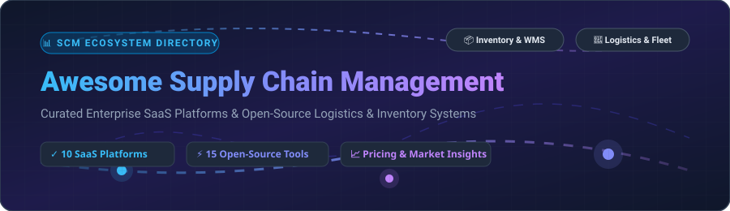

<!-- SEO Meta Keywords: Supply Chain Management, SCM Software, Open Source Logistics, Inventory Management, Demand Planning, WMS, Enterprise SaaS ERP, Route Optimization -->

# 📦 Awesome Supply Chain Management (SCM)

  
  
  
  

> **A curated, battle-tested list of enterprise SaaS platforms and open-source GitHub projects for Supply Chain Management (SCM), Logistics Execution, Warehouse Management (WMS), Demand Forecasting, and Inventory Optimization.**

---

## 📑 Table of Contents
- [📊 Market Overview & Intelligence](#-market-overview--intelligence)
- [☁️ Enterprise SaaS Platforms](#%EF%B8%8F-enterprise-saas-platforms)
- [⚡ Open-Source Software & Repositories](#-open-source-software--repositories)
- [🤝 How to Contribute](#-how-to-contribute)
- [☕ Support & Sponsorship](#-support--sponsorship)
- [⚠️ Disclaimer](#%EF%B8%8F-disclaimer)
- [📈 Star History](#-star-history)

---

## 📊 Market Overview & Intelligence

> 📈 **Market Size & Structure**: The global **Supply Chain Management (SCM)** market size is estimated at **$27.2 Billion in 2026** and is projected to reach **$45.2 Billion by 2030** (growing at a CAGR of ~11.2%). The market is **moderately fragmented**, where legacy enterprise ERP conglomerates (Microsoft, Oracle, SAP) command massive market shares in multi-tier supply chains, while specialized SaaS providers and open-source platforms compete fiercely in niche verticals like fleet management, WMS, demand forecasting, and humanitarian logistics.

---

## ☁️ Enterprise SaaS Platforms

Below is a curated comparison of leading commercial SCM suites, sorted by **Company Size (Valuation / Revenue)** descending.

| Rank | SaaS Platform / Company | Starting Tier Price 💲 | Free Tier / Trial Limit ⏳ | Company Size (Valuation / Revenue) 🏢 | Key Capabilities & Focus Area 🎯 |
| :---: | :--- | :--- | :--- | :--- | :--- |
| **1** | **[Microsoft Dynamics 365 SCM](https://dynamics.microsoft.com/en-us/supply-chain-management/)** | **$210 / user / month** | **30-Day Free Trial** (Azure sandbox with full demo features) | **$3.1 Trillion** (Valuation) / **$245B+** (Revenue) | AI-powered demand forecasting, IoT shop-floor telemetry, real-time procurement, and global WMS/TMS capabilities. |
| **2** | **[Oracle SCM Cloud](https://www.oracle.com/scm/)** | **$625 / user / month** | **30-Day Free Trial** ($300 Oracle Cloud credits included) | **$450 Billion** (Valuation) / **$53B** (Revenue) | Cloud-native enterprise suite for order management, inventory control, automated manufacturing, and global trade compliance. |
| **3** | **[SAP SCM / IBP](https://www.sap.com/products/scm.html)** | **$125 / user / month** | **30-Day Free Trial** (Guided SAP S/4HANA & IBP sandbox environment) | **$270 Billion** (Valuation) / **$35B** (Revenue) | The global enterprise standard for Integrated Business Planning (IBP), Extended Warehouse Management (EWM), and transportation routing. |
| **4** | **[Infor Supply Chain](https://www.infor.com/solutions/supply-chain)** | **$150 / user / month** | **30-Day Guided Demo** (Infor CloudSuite interactive trial) | **$125 Billion** (Parent Rev) / **$3.2B** (Division Rev) | Industry-specific SCM architectures built for discrete manufacturing, wholesale distribution, and healthcare networks. |
| **5** | **[Manhattan Associates](https://www.manh.com/)** | **$150 / user / month** | **30-Day Sandbox Trial** (Available upon partner request) | **$15 Billion** (Valuation) / **$950M** (Revenue) | Unified commerce and supply chain software recognized as a leader in enterprise WMS, TMS, and omnichannel fulfillment. |
| **6** | **[Blue Yonder](https://blueyonder.com/)** | **$3,500 / month** | **30-Day Interactive Demo** (Luminate Platform guided environment) | **$8.5 Billion** (Valuation) / **$1.3B** (Revenue) | Cognitive AI supply chain planning, dynamic inventory optimization, and automated warehouse execution systems. |
| **7** | **[Descartes Systems Group](https://www.descartes.com/)** | **$250 / month** | **14-Day Free Trial** (Descartes Macropoint & Route Planner trial) | **$8.5 Billion** (Valuation) / **$570M** (Revenue) | Global logistics technology platform specializing in fleet routing, last-mile delivery tracking, and customs compliance. |
| **8** | **[Coupa Supply Chain](https://www.coupa.com/)** | **$2,500 / month** | **14-Day Interactive Sandbox** (Spend Management & Risk analytics trial) | **$8.0 Billion** (Valuation) / **$1.0B** (Revenue) | Comprehensive business spend management, strategic sourcing, supplier risk monitoring, and supply chain network design. |
| **9** | **[Kinaxis RapidResponse](https://www.kinaxis.com/)** | **$2,500 / month** | **30-Day RapidStart Trial** (Interactive what-if scenario sandbox) | **$3.5 Billion** (Valuation) / **$430M** (Revenue) | Concurrent supply chain orchestration platform enabling real-time what-if scenario planning and rapid response execution. |
| **10** | **[E2open](https://www.e2open.com/)** | **$2,000 / month** | **30-Day Network Sandbox** (Multi-enterprise collaboration trial) | **$1.2 Billion** (Valuation) / **$630M** (Revenue) | End-to-end multi-enterprise supply chain orchestration connecting demand sensing, manufacturing supply, and logistics hubs. |

---

## ⚡ Open-Source Software & Repositories

Top open-source SCM projects, inventory platforms, routing solvers, and algorithm libraries sorted strictly by **GitHub Star Count** descending.

| Rank | Repository & Link | GitHub Stars 🌟 | License 📜 | Ecosystem & Key Features 💡 |
| :---: | :--- | :--- | :--- | :--- |
| **1** | **[Odoo](https://github.com/odoo/odoo)** |  | `LGPL-3.0` | Enterprise open-source ERP featuring integrated inventory control, MRP, purchasing, barcode scanning, and multi-warehouse logistics. |
| **2** | **[ERPNext](https://github.com/frappe/erpnext)** |  | `GPL-3.0` | Comprehensive open-source ERP platform built on Frappe with robust supply chain management, stock ledger, BOM explosion, and procurement. |
| **3** | **[Snipe-IT](https://github.com/snipe/snipe-it)** |  | `AGPL-3.0` | Popular open-source IT asset and inventory management system powered by Laravel, featuring barcode/QR code generation and audit logs. |
| **4** | **[Google OR-Tools](https://github.com/google/or-tools)** |  | `Apache-2.0` | Google's premier optimization suite for solving complex Vehicle Routing Problems (VRP), flow networks, bin packing, and job-shop scheduling. |
| **5** | **[InvenTree](https://github.com/inventree/InvenTree)** |  | `MIT` | Modern Python/Django open-source inventory control system with part tracking, BOM management, supplier integration, and barcode support. |
| **6** | **[GraphHopper](https://github.com/graphhopper/graphhopper)** |  | `Apache-2.0` | High-performance open-source routing engine in Java for fleet optimization, distance matrix computation, and last-mile logistics routing. |
| **7** | **[Fleetbase](https://github.com/fleetbase/fleetbase)** |  | `MIT` | Modular open-source logistics operating system providing order dispatching, driver management APIs, real-time routing, and tracking. |
| **8** | **[Pyomo](https://github.com/pyomo/pyomo)** |  | `BSD-3-Clause` | Versatile Python-based open-source optimization modeling language used for supply chain network design, transportation, and facility location. |
| **9** | **[ModernWMS](https://github.com/fjykTec/ModernWMS)** |  | `MIT` | Clean, open-source Warehouse Management System (WMS) designed for small and medium-sized enterprises with Docker single-command deploy. |
| **10** | **[Apache OFBiz](https://github.com/apache/ofbiz-framework)** |  | `Apache-2.0` | Battle-tested Java ERP framework offering full supply chain management, Material Requirements Planning (MRP), and warehouse automation. |
| **11** | **[OpenBoxes](https://github.com/openboxes/openboxes)** |  | `EPL-2.0` | Leading open-source inventory and supply chain system tailored for healthcare and humanitarian logistics used across 12+ countries. |
| **12** | **[frePPLe](https://github.com/frePPLe/frepple)** |  | `AGPL-3.0` | Open-source supply chain planning suite offering demand forecasting, inventory optimization, production scheduling, and Odoo ERP integration. |
| **13** | **[Tryton](https://github.com/tryton/tryton)** |  | `GPL-3.0` | Modular three-tier open-source business software with modules for stock management, purchase order automation, and shipment tracking. |
| **14** | **[Open Inventory Manager](https://github.com/SumukhaS291299/Open-Inventory-Manager)** |  | `MIT` | High-performance Go microservice backed by embedded BadgerDB for ultra-low latency inventory indexing and RESTful operations. |
| **15** | **[supplycm](https://pypi.org/project/supplycm/)** | PyPI Package | `MIT` | Pure-Python library containing 397 supply chain algorithms (EOQ, Croston forecasting, VRP, BOM explosion, SIMPLEX) with zero dependencies. |

---

## 🤝 How to Contribute

Contributions are welcome! Please follow these guidelines:

1. **Fork** the repository.
2. Add or update entries in `README.md` maintaining table formatting.
3. Provide accurate links, starting price tiers, free trial details, or open-source license info.
4. Submit a **Pull Request** with a detailed explanation.

Check out our main awesome collection at [Awesome-Awesome-Awesome](https://github.com/ishandutta2007/Awesome-Awesome-Awesome)!

---

## ☕ Support & Sponsorship

If you find this curated supply chain management resource helpful, please consider supporting the project!

- ⭐ **Star** this repository to show appreciation.
- 🔀 **Fork** and share it with operations engineers, logistics managers, and developers.
- 💖 **Sponsor / Buy me a Coffee**: Support ongoing open-source updates on [GitHub Sponsors](https://github.com/sponsors/ishandutta2007).

---

## ⚠️ Disclaimer

- This directory is **community-curated** for educational, comparison, and research purposes.
- Product details, pricing tiers, and trial policies are subject to change by respective vendors.
- Open-source platforms require operational infrastructure planning, data security compliance, and maintenance resources.

---

## 📈 Star History

